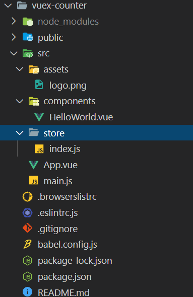
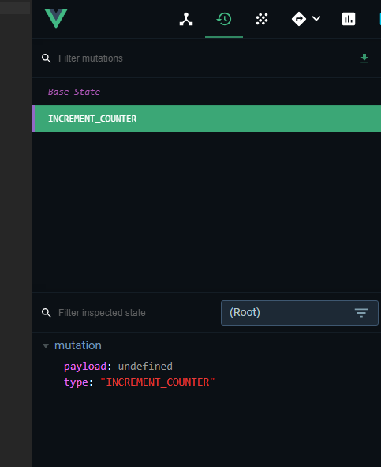

# VueJS - VueX: Book Shop application

September 2020

\> 🔨 Book Shop application with Vuex. From Udemy '[Devenir opérationnel rapidement en Vue et Vuex](https://www.udemy.com/course/devenir-operationnel-rapidement-en-vue-et-vuex/)'

\* * *

Demo on [Github page](https://raigyo.github.io/vuex-shop/)

Server: [vue-shop-json-server](https://my-json-server.typicode.com/raigyo/vue-shop-json-server)


## Vue main concepts

### What is vue?

- Vue (or Vue.js) is an open-source front-end JavaScript framework
- Vue is the **view** layer of an MVC application (Model View Controller)
- Vue is currently [one of the most popular](https://github.com/vuejs/vue) JavaScript libraries/frameworks
- Unlike other popular JavaScript projects, Vue is not backed by a large corporation like React (Facebook) or Angular (Google). Vue was originally written by [Evan You](https://github.com/yyx990803) and the open-source community.

### Tools

For browser:

- [Vue DevTools on Chrome](https://chrome.google.com/webstore/detail/vuejs-devtools/nhdogjmejiglipccpnnnanhbledajbpd?hl=en)
- [Vue DevTools on FireFox](https://addons.mozilla.org/en-US/firefox/addon/vue-js-devtools/)

For IDE:

- [Vue VSCode Snippets](https://marketplace.visualstudio.com/items?itemName=sdras.vue-vscode-snippets)

vbase

vimport

vmethod

vdata

...

You will need [Vue CLI](https://cli.vuejs.org/).

`vue create my-project`

Select your options automatic or manual (then select features: eslint, vuex...)

`cd my-project`

`npm run serve`




## What is vueX?

Vuex is a **state management pattern + library** for Vue.js applications. It serves as a centralized store for all the components in an application, with rules ensuring that the state can only be mutated in a predictable fashion. It also integrates with Vue's official [devtools extension](https://github.com/vuejs/vue-devtools) to provide advanced features such as zero-config time-travel debugging and state snapshot export / import.

VueX is is like Redfux for React but with  special features for Vue.


- **Getters** will make values able to show statically in our templates. In other words, getters can read the value, but not mutate the state.
- **Mutations** (we commit mutations) will allow us to update the state, but they will always be **synchronous**. Mutations are the only way to change data in the state in the store.
- **Actions** (we dispatch actions) will allow us to update the state, **asynchronously**, but will use an existing mutation. This can be very helpful if you need to perform a few different mutations at once in a particular order.

**store / index.js**

````js
import Vue from 'vue'
import Vuex from 'vuex'

Vue.use(Vuex)

export default new Vuex.Store({
  state: {
  },
  mutations: {
  },
  actions: {
  },
  modules: {
  }
})
````

#### Exemple: Counter without VueX

**Counter.vue**

````vue
<template>
  <div>
    <h2>Counter</h2>
    <div>{{ currentValue }}</div>
    <button @click="increment">+</button>
    <button @click="decrement">-</button>
  </div>
</template>

<script>
  export default {
    data () {
      return {
        currentValue: 0
      }
    },
    methods: {
      increment() {
        this.currentValue = this.currentValue +1;
      },
      decrement() {
        this.currentValue = this.currentValue -1;
      }
    },
  }
</script>
````

#### Exemple: Counter with VueX

**Counter.vue**

````vue
<template>
  <div>
    <h2>Counter</h2>
    <div>{{ currentValue }}</div>
    <button @click="increment">+</button>
    <button @click="decrement">-</button>
  </div>
</template>

<script>
  export default {
    methods: {
      increment() {
        this.$store.commit('INCREMENT_COUNTER');
      },
      decrement() {
        this.$store.commit('DECREMENT_COUNTER');
      }
    },
    computed: {
      currentValue() {
        return this.$store.state.currentValue;
      }
    },
  }
</script>
````

**store / index.js**

````js
import Vue from 'vue'
import Vuex from 'vuex'

Vue.use(Vuex)

export default new Vuex.Store({
  state: {
    currentValue: 0
  },
  mutations: {
    //METHOD(state, payload)
    //Payload: other datas
    INCREMENT_COUNTER(state){
      state.currentValue +=1;
    },
    DECREMENT_COUNTER(state){
      state.currentValue -=1;
    },
  },
  actions: {
  },
  getters: {      
  },
  modules: {
  }
})
````

 


 


## Useful links

- [codeconcept / vuex-counter](https://github.com/codeconcept/vuex-counter)
- [codeconcept / vuex-ideas](https://github.com/codeconcept/vuex-ideas)
- [codeconcept / vuex-commerce](https://github.com/codeconcept/vuex-commerce)
- [Vue Development In 2019: What You Need To Know](https://vuejsdevelopers.com/2018/12/04/vue-js-2019-knowledge-map/)
- [Vue.js: Guide](https://v1.vuejs.org/guide/syntax.html)
- [How to map your VueX data to Vue models](https://dev.to/aminnairi/how-to-map-your-vuex-data-to-vue-models-2o6l)
- [Vuex, qu'est-ce que c'est ?](https://vuex.vuejs.org/fr/)
- [Intro to Vue.js: Vuex](https://css-tricks.com/intro-to-vue-4-vuex/)
- [json-server](https://www.npmjs.com/package/json-server?activeTab=versions)
- [My JSON Server](https://my-json-server.typicode.com/)
- [Create a FREE 🎉 Fake REST API with JSON Server Running On The Internet](https://medium.com/@royanimesh2211/create-a-free-fake-rest-api-with-json-server-running-on-the-internet-30a627c7c20d)
